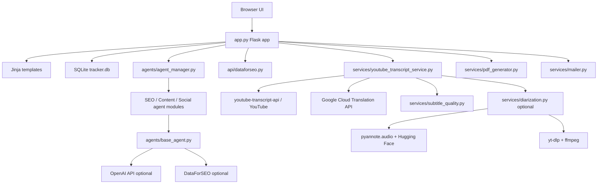
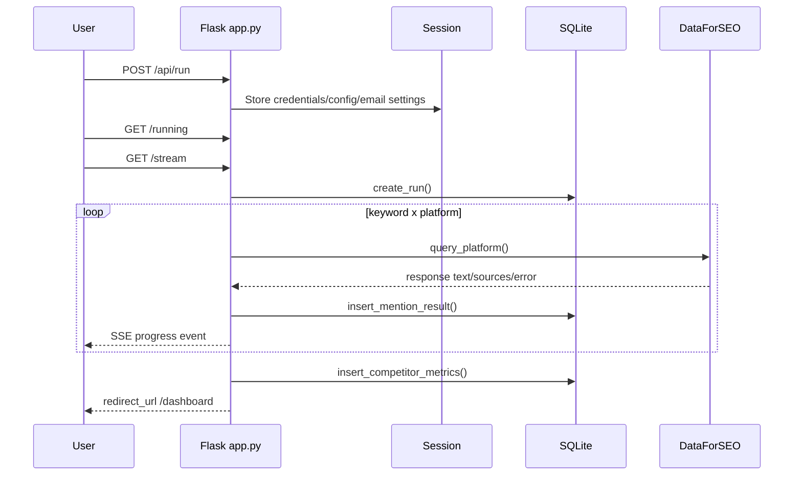
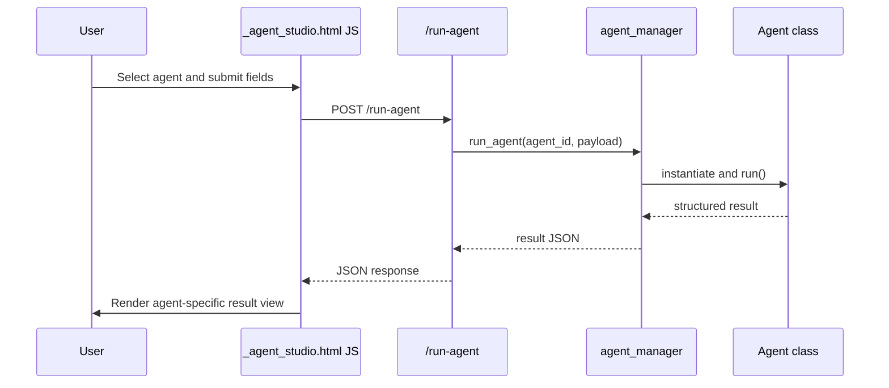
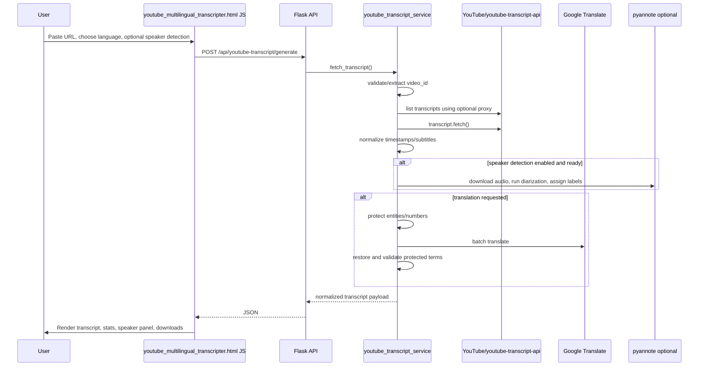

# Audilysis Master Handoff

Generated for the Audilysis workspace on 2026-07-29.

This document is intended to let a new ChatGPT/Codex session understand the current project without relying on previous conversation context. It is based on inspection of the repository files, templates, Python modules, tests, requirements, environment-variable references, and available Git history.

Do not place secrets in this file. Environment variables are listed by name only.

## 1. Executive Summary

Audilysis 2.0 is a Flask application for AI mention tracking, SEO/content/social agent workflows, reporting, and a YouTube multilingual transcript tool.

The application is currently a single Flask app in `app.py` rather than a blueprint-based project. It uses SQLite for tracker run history, Jinja templates for the UI, Tailwind via CDN for styling, Font Awesome for icons, Chart.js for dashboard charts, and Python service modules for email, PDF generation, transcript extraction, subtitle processing, translation, and optional speaker diarization.

The newest major feature is the **Free YouTube Multilingual Transcripter**, available at `/youtube-multilingual-transcripter`. It fetches real YouTube caption data through `youtube-transcript-api`, optionally translates subtitles using Google Cloud Translation API, formats professional subtitles, supports TXT/SRT/JSON/VTT downloads, supports optional Webshare/generic proxy configuration, and supports optional speaker diarization using `pyannote.audio`.

## 2. Project Vision and Goals

Audilysis is designed as an AI marketing intelligence workstation.

Primary goals:

- Track brand visibility across Google AI Mode and LLM answer platforms.
- Compare brand and competitor share of voice.
- Generate reports and PDF exports.
- Provide modular SEO, content, and social media agents.
- Provide a production-quality YouTube transcript and translation workflow.
- Keep integrations honest: when credentials or live data are missing, the app should report that rather than invent fake outputs.

## 3. Technology Stack

| Area | Technology | Purpose |
|---|---|---|
| Web framework | Flask | Main backend app and route handling |
| WSGI | Gunicorn, `wsgi.py` | Production entry point |
| Database | SQLite | Local tracker run storage |
| Templates | Jinja2 | Server-rendered pages |
| Styling | Tailwind CSS CDN, custom CSS | Application layout and UI |
| Charts | Chart.js CDN | Dashboard and report charts |
| Icons | Font Awesome CDN | Sidebar, buttons, and agent icons |
| HTTP | `requests` | External API calls |
| SEO/AI data | DataForSEO | Brand mention and AI platform tracking |
| LLM generation | OpenAI Chat Completions | Some content/social/marketing agents |
| PDF | ReportLab, Matplotlib | PDF report rendering and charts |
| HTML parsing | BeautifulSoup, `html.parser` | Crawl/audit utilities |
| YouTube captions | `youtube-transcript-api==1.2.4` | Real YouTube transcript extraction |
| Translation | Google Cloud Translation API v2 | Server-side transcript translation |
| Environment loading | `python-dotenv` | Loads project `.env` via `agents/runtime_config.py` |
| Optional diarization | `pyannote.audio`, `yt-dlp`, `ffmpeg` | Speaker detection from audio |

## 4. Complete Folder Structure

Project root:

```text
.
├── .agents/
├── .codex/
├── .env.example
├── .git/
├── .gitignore
├── .venv/
├── .vscode/
├── AUDILYSIS_MASTER_HANDOFF.md
├── README.md
├── agents/
├── api/
├── app.py
├── data/
├── db/
├── requirements-diarization.txt
├── requirements.txt
├── scripts/
├── services/
├── static/
├── templates/
├── tests/
├── venv/
└── wsgi.py
```

Important notes:

- `.env` exists locally but is intentionally not documented with values.
- `data/tracker.db` is a runtime SQLite database and should be treated as mutable application data.
- Both `venv/` and `.venv/` exist. Recent verification used `.venv`.

## 5. File-by-File Explanation

### Root Files

| File | Purpose |
|---|---|
| `app.py` | Main Flask application, route definitions, app initialization, tracker workflow, YouTube transcript endpoints, dashboard/report routes, local startup behavior |
| `wsgi.py` | Gunicorn-compatible WSGI entry point: imports `app` from `app.py` |
| `requirements.txt` | Core Python dependencies |
| `requirements-diarization.txt` | Optional speaker detection dependencies |
| `.env.example` | Name-only environment variable template |
| `.gitignore` | Git ignore rules |
| `README.md` | Basic local run, environment, speaker detection, and test instructions |
| `AUDILYSIS_MASTER_HANDOFF.md` | This generated handoff document |

### `agents/`

| File | Purpose |
|---|---|
| `agents/__init__.py` | Package marker |
| `agents/agent_manager.py` | Central registry and dispatcher for all SEO/content/social agents |
| `agents/base_agent.py` | Abstract base class and shared helpers for validation, response envelopes, DataForSEO calls, env config |
| `agents/runtime_config.py` | Loads `.env` and exposes `get_env_value()` / `load_env_config()` |
| `agents/ai_marketing_agent.py` | Shared OpenAI JSON-agent helper |
| `agents/llm_client.py` | Low-level OpenAI Chat Completions HTTP helper |
| `agents/marketing_agent_utils.py` | Shared input/context helper functions |
| `agents/crawl_utils.py` | URL normalization, page fetch, HTML parsing, simple crawl/audit helpers |
| `agents/technical_audit.py` | Technical SEO audit agent using crawl data and optional PageSpeed/CrUX/OpenAI |
| `agents/competitor_analysis.py` | Competitor comparison agent using real crawl and optional APIs |
| `agents/keyword_research.py` | Keyword opportunity agent using crawl-visible context and optional API data |
| `agents/keyword_clustering.py` | Clusters keyword lists into topic/content groups |
| `agents/content_gap.py` | Identifies content gaps |
| `agents/serp_analysis.py` | SERP research agent |
| `agents/rank_tracking.py` | Ranking/movement signal agent |
| `agents/on_page_optimizer.py` | On-page recommendation agent |
| `agents/schema_agent.py` | Schema markup recommendation agent |
| `agents/internal_linking.py` | Internal linking recommendation agent |
| `agents/backlink_prospecting.py` | Link-building opportunity agent |
| `agents/outreach.py` | Outreach plan/email guidance agent |
| `agents/backlink_verification.py` | Backlink quality verification agent |
| `agents/weekly_report.py` | Weekly SEO report agent |
| `agents/monthly_report.py` | Monthly SEO report agent |
| `agents/strategy.py` | SEO strategy agent |
| `agents/content_calendar.py` | Content calendar generation agent |
| `agents/seo_brief.py` | SEO content brief agent |
| `agents/blog_writer.py` | Blog draft agent |
| `agents/humanizer.py` | AI content humanizer agent |
| `agents/fact_check.py` | Content fact-checking/risk agent |
| `agents/publisher.py` | Base publishing-prep agent |
| `agents/content_publisher.py` | Content-specific publisher alias/subclass |
| `agents/social_calendar.py` | Social calendar agent |
| `agents/caption.py` | Caption generation agent |
| `agents/social_caption.py` | Social caption alias/subclass |
| `agents/image_agent.py` | Image concept/prompt agent |
| `agents/social_image.py` | Social image alias/subclass |
| `agents/video_agent.py` | Video script/content agent |
| `agents/social_video.py` | Social video alias/subclass |
| `agents/social_publisher.py` | Social post publishing-prep agent |
| `agents/analytics.py` | Social analytics recommendation agent |
| `agents/social_analytics.py` | Social analytics alias/subclass |

### `api/`

| File | Purpose |
|---|---|
| `api/dataforseo.py` | DataForSEO platform query adapter for Google AI Mode, ChatGPT, Perplexity, Gemini, and Claude tracking |

### `db/`

| File | Purpose |
|---|---|
| `db/storage.py` | SQLite schema creation and run/result/metric persistence helpers |

### `services/`

| File | Purpose |
|---|---|
| `services/youtube_transcript_service.py` | YouTube transcript URL validation, transcript retrieval, proxy support, translation, downloads, error mapping |
| `services/subtitle_quality.py` | Timestamp normalization, sentence-aware caption reconstruction, subtitle segmentation, line balancing, validation |
| `services/translation_quality.py` | Entity/number protection before translation, restoration, validation, Hindi post-processing |
| `services/glossary.py` | Central technical glossary and Hindi style replacement map |
| `services/technical_glossary.py` | Currently empty placeholder file |
| `services/diarization.py` | Optional pyannote speaker diarization, diagnostics, audio download, label assignment |
| `services/mailer.py` | SMTP report email sender |
| `services/pdf_generator.py` | ReportLab/Matplotlib PDF report generator |

### `templates/`

| File | Purpose |
|---|---|
| `templates/layout.html` | Main shared shell, sidebar navigation, top bar, CSS/CDN includes |
| `templates/base.html` | Minimal template extending `layout.html`; currently acts as a compatibility placeholder |
| `templates/setup.html` | Tracker setup form |
| `templates/running.html` | SSE progress page for tracker runs |
| `templates/dashboard.html` | Main analytics dashboard |
| `templates/report.html` | Standalone/offline report template |
| `templates/agents.html` | SEO Agent Studio wrapper |
| `templates/content_agents.html` | Content Agent Studio wrapper |
| `templates/social_agents.html` | Social Agent Studio wrapper |
| `templates/_agent_studio.html` | Large shared agent studio UI and inline JavaScript renderer |
| `templates/seo_reports.html` | Report-agent page |
| `templates/seo_strategy.html` | SEO strategy page |
| `templates/youtube_multilingual_transcripter.html` | YouTube transcripter UI and inline JavaScript |

### `static/`

| File | Purpose |
|---|---|
| `static/style.css` | Shared custom CSS for scrollbars, agent studio layout, result panels, responsive/stability fixes |

### `tests/`

| File | Purpose |
|---|---|
| `tests/test_agents.py` | Route, agent registry, agent output, dashboard, PDF/report, and schema tests |
| `tests/test_youtube_transcript.py` | YouTube URL parsing, proxy diagnostics, transcript/translation/download APIs, error mapping tests |
| `tests/test_subtitle_quality.py` | Subtitle timing/segmentation, translation quality, speaker diarization behavior tests |

### `scripts/`

| File | Purpose |
|---|---|
| `scripts/diagnose_youtube_transcript.py` | CLI diagnostic helper for direct installed-library YouTube transcript testing |

## 6. Overall System Architecture

Audilysis currently uses a monolithic Flask application pattern:

- `app.py` constructs `Flask(__name__)`.
- `init_db()` is called during import/startup.
- Speaker detection diagnostics are logged during app startup.
- Routes are declared directly with `@app.route`.
- There are no Flask blueprints.
- Feature logic is delegated to `agents/`, `api/`, `db/`, and `services/` modules.
- Templates extend `layout.html`; many pages include inline JavaScript.



## 7. Request & Data Flow

### Tracker Run Flow



### Agent Studio Flow



### YouTube Transcript Flow



## 8. Backend Documentation

### App Startup

`app.py` performs these actions at import/startup:

1. Imports local database, API, services, and agent modules.
2. Creates `app = Flask(__name__)`.
3. Sets `app.secret_key` from `FLASK_SECRET_KEY` or a random generated value.
4. Calls `init_db()` to ensure SQLite tables exist.
5. Calls `log_speaker_detection_diagnostics()` to print optional diarization readiness.

When run directly with `python app.py`, it:

- Finds an available local port starting at `5000`.
- Opens a browser in a background thread.
- Runs Flask on `127.0.0.1`.
- Enables debug only when `FLASK_DEBUG` is truthy.

Production should use `wsgi:app` with Gunicorn.

### Flask App Factory / Blueprints

- App factory: **No**.
- Blueprints: **No**.
- Route registration: direct `@app.route` decorators in `app.py`.

### Error Handling

General app errors are mostly handled per-route. The YouTube transcript feature has explicit custom exception classes:

- `YouTubeTranscriptError`
- `ValidationError`
- `ConfigurationError`
- `UpstreamError`

`youtube_transcript_error_response()` converts these into JSON:

```json
{
  "success": false,
  "status": "error",
  "error": "error_code",
  "message": "user-safe message"
}
```

## 9. Frontend Documentation

The frontend is server-rendered with Jinja templates and inline page scripts.

Global UI:

- `templates/layout.html` defines the full shell.
- Sidebar sections are hardcoded in `layout.html`.
- Tailwind CSS is loaded via CDN.
- Font Awesome is loaded via CDN.
- Chart.js is loaded globally via CDN.
- `static/style.css` holds custom CSS for layout stability and result rendering.

Page-specific frontend:

- `setup.html`: tracker configuration form and client-side setup submission.
- `running.html`: listens to `/stream` SSE events.
- `dashboard.html`: renders metrics and charts from server-provided JSON.
- `_agent_studio.html`: renders schemas from `agents-data`, dynamically builds forms, posts to `/run-agent`, and renders agent-specific results.
- `youtube_multilingual_transcripter.html`: loads languages/health, posts to generate API, renders transcript segments/plain text, speaker panel, copy, and downloads.

Security note:

- Transcript rendering uses `textContent` for transcript text, avoiding raw `innerHTML` for untrusted transcript content.
- Some agent studio rendering uses templated HTML strings with local escaping helpers; preserve/extend escaping carefully.

## 10. AI Agents

Agents are registered in `agents/agent_manager.py`. Each entry maps an `agent_id` to a group and class.

Groups:

| Group Constant | UI Group |
|---|---|
| `SEO_GROUP` | `SEO AI Agents` |
| `CONTENT_GROUP` | `Content` |
| `SOCIAL_GROUP` | `Social` |

Registered agents:

| Agent ID | Class | Group | Purpose |
|---|---|---|---|
| `technical_audit` | `TechnicalAuditAgent` | SEO | Technical SEO auditing |
| `competitor_analysis` | `CompetitorAnalysisAgent` | SEO | Competitor website comparison |
| `keyword_research` | `KeywordResearchAgent` | SEO | Keyword opportunity discovery |
| `keyword_clustering` | `KeywordClusteringAgent` | SEO | Keyword/topic clustering |
| `content_gap` | `ContentGapAgent` | SEO | Content gap identification |
| `serp_analysis` | `SerpAnalysisAgent` | SEO | SERP landscape analysis |
| `rank_tracking` | `RankTrackingAgent` | SEO | Ranking potential/movement signals |
| `on_page_optimizer` | `OnPageOptimizerAgent` | SEO | On-page optimization recommendations |
| `schema_agent` | `SchemaAgent` | SEO | Schema markup suggestions |
| `internal_linking` | `InternalLinkingAgent` | SEO | Internal linking plans |
| `backlink_prospecting` | `BacklinkProspectingAgent` | SEO | Link-building opportunities |
| `outreach` | `OutreachAgent` | SEO | Outreach plans |
| `backlink_verification` | `BacklinkVerificationAgent` | SEO | Backlink quality checks |
| `weekly_report` | `WeeklyReportAgent` | SEO | Weekly SEO reporting |
| `monthly_report` | `MonthlyReportAgent` | SEO | Monthly SEO reporting |
| `strategy` | `StrategyAgent` | SEO | SEO strategy |
| `content_calendar` | `ContentCalendarAgent` | Content | Content calendar ideas |
| `seo_brief` | `SEOBriefAgent` | Content | SEO briefs |
| `blog_writer` | `BlogWriterAgent` | Content | Blog drafts |
| `humanizer` | `HumanizerAgent` | Content | Human-friendly rewrites |
| `fact_check` | `FactCheckAgent` | Content | Factual/risk review |
| `publisher` | `ContentPublisherAgent` | Content | Publishing package/checklist |
| `social_calendar` | `SocialCalendarAgent` | Social | Social calendar |
| `caption` | `SocialCaptionAgent` | Social | Social captions |
| `image_agent` | `SocialImageAgent` | Social | Image concepts/prompts |
| `video_agent` | `SocialVideoAgent` | Social | Video scripts |
| `social_publisher` | `SocialPublisherAgent` | Social | Social publishing prep |
| `analytics` | `SocialAnalyticsAgent` | Social | Social analytics recommendations |

Common agent conventions:

- Subclass `BaseAgent`.
- Define `NAME`, `DESCRIPTION`, `ICON`, `CATEGORY`, and `INPUT_SCHEMA`.
- Implement `run(input_data)`.
- Return structured JSON via `build_structured_response()` when possible.
- Fail honestly with missing-key/missing-input responses instead of fake metrics.

## 11. API Integrations

| Integration | Module | Authentication | Environment Variables |
|---|---|---|---|
| DataForSEO | `api/dataforseo.py`, `BaseAgent.dataforseo_post()` | HTTP Basic Auth | `DATAFORSEO_LOGIN`, `DATAFORSEO_PASSWORD` |
| OpenAI Chat Completions | `agents/llm_client.py` | Bearer token | `OPENAI_API_KEY` |
| Google PageSpeed Insights | `agents/technical_audit.py`, `agents/competitor_analysis.py` | API key | `PAGESPEED_API_KEY` |
| Chrome UX Report | `agents/technical_audit.py`, `agents/competitor_analysis.py` | API key | `CRUX_API_KEY` |
| Google Translation API v2 | `services/youtube_transcript_service.py` | Server-side API key | `GOOGLE_TRANSLATE_API_KEY` |
| YouTube transcript extraction | `youtube-transcript-api` | No key; optional proxy | `WEBSHARE_PROXY`, `WEBSHARE_PROXY_USERNAME`, `WEBSHARE_PROXY_PASSWORD`, `WEBSHARE_PROXY_HOST`, `WEBSHARE_PROXY_PORT`, `YOUTUBE_PROXY_HTTP_URL`, `YOUTUBE_PROXY_HTTPS_URL` |
| Hugging Face / pyannote | `services/diarization.py` | HF read token | `HUGGINGFACE_TOKEN` |
| SMTP | `services/mailer.py` | User-provided SMTP settings stored in Flask session | Session fields from setup form |

Other declared env names (`SERPAPI_KEY`, `SEMRUSH_API_KEY`, `AHREFS_API_KEY`, `MOZ_API_KEY`) are present in config templates and may be used by future or partially implemented agent workflows.

## 12. Environment Variables

Name-only list from `.env.example` and code references:

```text
DATAFORSEO_LOGIN
DATAFORSEO_PASSWORD
PAGESPEED_API_KEY
CRUX_API_KEY
SERPAPI_KEY
SEMRUSH_API_KEY
AHREFS_API_KEY
MOZ_API_KEY
OPENAI_API_KEY
FLASK_SECRET_KEY
FLASK_DEBUG
GOOGLE_TRANSLATE_API_KEY
HUGGINGFACE_TOKEN
WEBSHARE_PROXY
WEBSHARE_PROXY_USERNAME
WEBSHARE_PROXY_PASSWORD
WEBSHARE_PROXY_HOST
WEBSHARE_PROXY_PORT
YOUTUBE_PROXY_HTTP_URL
YOUTUBE_PROXY_HTTPS_URL
AUDILYSIS_TRANSCRIPT_DEBUG
```

Never commit `.env`. Never print secret values in logs or documentation.

## 13. Database Structure

SQLite database path:

```text
data/tracker.db
```

Schema is initialized in `db/storage.py`.

### `runs`

| Column | Type | Notes |
|---|---|---|
| `id` | INTEGER PRIMARY KEY AUTOINCREMENT | Run ID |
| `brand_domain` | TEXT NOT NULL | Brand domain |
| `brand_name` | TEXT NOT NULL | Brand name |
| `country` | TEXT NOT NULL | Target country |
| `language` | TEXT NOT NULL | Target language |
| `competitors` | TEXT | JSON list |
| `run_date` | DATETIME | Defaults/current timestamp |

### `mention_results`

| Column | Type | Notes |
|---|---|---|
| `id` | INTEGER PRIMARY KEY AUTOINCREMENT | Result ID |
| `run_id` | INTEGER | Foreign key to `runs` |
| `keyword` | TEXT NOT NULL | Keyword checked |
| `platform` | TEXT NOT NULL | Platform checked |
| `mentioned` | BOOLEAN | Brand mention result; nullable on errors |
| `mention_position` | INTEGER | Approximate line position |
| `sources_cited` | TEXT | JSON list of URLs |
| `competitor_mentions` | TEXT | JSON object |
| `ai_response_text` | TEXT | Stored response text |
| `timestamp` | DATETIME | Result timestamp |

### `competitor_metrics`

| Column | Type | Notes |
|---|---|---|
| `id` | INTEGER PRIMARY KEY AUTOINCREMENT | Metric ID |
| `run_id` | INTEGER | Foreign key to `runs` |
| `domain` | TEXT NOT NULL | Brand or competitor domain |
| `total_mentions` | INTEGER NOT NULL | Mention count |
| `avg_position` | REAL | Average mention position |
| `share_of_voice` | REAL NOT NULL | Share-of-voice percent |

## 14. Routes and Endpoints

| Method | Route | Purpose |
|---|---|---|
| GET | `/` | Redirects to `/dashboard` if latest run exists, else `/setup` |
| GET | `/setup` | Tracker setup page |
| GET | `/favicon.ico` | Returns 204 to avoid noisy favicon logs |
| POST | `/api/run` | Stores tracker config/credentials/email settings in session |
| GET | `/running` | Tracker progress page |
| POST | `/api/cancel` | Cancels current session run |
| GET | `/stream` | Server-sent events for tracker execution |
| GET | `/agents` | SEO Agent Studio |
| GET | `/content-agents` | Content Agent Studio |
| GET | `/social-agents` | Social Agent Studio |
| GET | `/youtube-multilingual-transcripter` | YouTube transcripter page |
| GET | `/api/youtube-transcript/health` | YouTube/translation/speaker/proxy diagnostics |
| GET | `/api/youtube-transcript/languages` | Supported translation languages |
| POST | `/api/youtube-transcript/generate` | Fetch real transcript and optionally translate/diarize |
| POST | `/api/youtube-transcript/translate` | Translate existing normalized transcript segments |
| GET | `/api/youtube-transcript/download/<path:video_id>` | Download transcript as TXT/SRT/JSON/VTT |
| GET | `/seo-reports` | SEO report agent page |
| GET | `/seo-strategy` | SEO strategy page |
| POST | `/run-agent` | Runs registered agent |
| GET | `/dashboard` | Latest/current tracker dashboard |
| GET | `/download-report` | PDF report download |
| POST | `/api/email-report` | Email PDF report via SMTP settings in session |

## 15. Services and Utilities

### YouTube Transcript Service

`services/youtube_transcript_service.py` handles:

- URL and video ID validation.
- Supported URL forms: watch URLs, `youtu.be`, embeds, Shorts, and raw 11-character IDs.
- Language validation and language list.
- Transcript listing/fetching through `youtube-transcript-api==1.2.4`.
- Optional Webshare or generic proxy configuration.
- Custom error mapping for disabled transcripts, no transcript, unavailable video, IP/request blocking, rate limits, proxy errors, timeouts, XML parse errors, and generic upstream failures.
- Caption normalization through `services/subtitle_quality.py`.
- Optional speaker detection through `services/diarization.py`.
- Google Translation API calls with batching.
- Entity/number protection through `services/translation_quality.py`.
- Download formatting for TXT, SRT, VTT, and JSON.

### Subtitle Quality Service

`services/subtitle_quality.py` handles:

- Timestamp normalization.
- End timestamp generation.
- Non-overlap repair.
- Sentence-aware caption merging.
- Subtitle splitting and line balancing.
- Punctuation optimization.
- Validation of empty/invalid captions.

Important constraints:

- Minimum caption duration: 1 second.
- Maximum caption duration: 7 seconds.
- Target/max line length: 42 characters.
- Max caption characters: 84.

### Translation Quality Service

`services/translation_quality.py` handles:

- Protected placeholder replacement for URLs, files, code identifiers, numbers, and technical glossary terms.
- Context preparation for technical/software language.
- Restoration after translation.
- Number/entity validation.
- Hindi style post-processing for common technical transliterations.

### Speaker Diarization Service

`services/diarization.py` handles:

- Diagnostics for `pyannote.audio`, `yt-dlp`, `ffmpeg`, `HUGGINGFACE_TOKEN`, and required Hugging Face model access.
- Optional diarizer selection through `get_diarizer(enabled=True/False)`.
- Graceful fallback when setup is unavailable.
- Audio download via `yt-dlp`.
- Audio processing with `pyannote/speaker-diarization-3.1`.
- Speaker-turn to caption-segment matching by overlap.
- Stable neutral labels like `Speaker 1`, `Speaker 2`.
- Avoiding labels when only one speaker is detected.

Required Hugging Face models currently checked:

```text
pyannote/speaker-diarization-3.1
pyannote/segmentation-3.0
pyannote/speaker-diarization-community-1
```

### PDF and Email

- `services/pdf_generator.py` builds PDF report bytes using ReportLab and Matplotlib.
- `services/mailer.py` sends SMTP email with PDF attachment.

## 16. Authentication & Security

Current authentication status:

- There is no user login/authentication system in the inspected codebase.
- Flask sessions store tracker configuration, DataForSEO credentials submitted via setup, email settings, and current run IDs.
- `FLASK_SECRET_KEY` should be configured in production. If missing, `app.py` uses a random key, which is unsuitable for stable production sessions across restarts.

Security-sensitive areas:

- `.env` must remain uncommitted.
- API keys are read server-side from environment variables.
- Google Translation key is not exposed in frontend code.
- Hugging Face token is not exposed in frontend code.
- Proxy credentials must remain in environment variables only.
- Transcript content should not be logged in full.
- YouTube transcript debug logging is controlled by `AUDILYSIS_TRANSCRIPT_DEBUG`.
- Current app has no CSRF protection package or login authorization layer.
- Current app uses Tailwind, Chart.js, Font Awesome, and Google Fonts from CDNs.

## 17. Configuration Files

| File | Purpose |
|---|---|
| `.env.example` | Template for environment variable names |
| `agents/runtime_config.py` | Loads `.env` from project root at import time |
| `requirements.txt` | Core dependency declaration |
| `requirements-diarization.txt` | Optional diarization dependency declaration |
| `wsgi.py` | Production WSGI entry point |
| `.gitignore` | Git ignore configuration |
| `.vscode/` | Local editor settings folder |

## 18. Dependencies and Why Each Is Used

### Core `requirements.txt`

| Dependency | Why Used |
|---|---|
| `flask` | Web app, routing, templates, sessions |
| `requests` | External HTTP APIs |
| `reportlab` | PDF rendering |
| `matplotlib` | Chart generation for PDFs |
| `beautifulsoup4` | HTML parsing for crawl/audit logic |
| `gunicorn` | Production WSGI server |
| `youtube-transcript-api==1.2.4` | YouTube caption retrieval and official proxy support |
| `python-dotenv` | Project `.env` loading |

### Optional `requirements-diarization.txt`

| Dependency | Why Used |
|---|---|
| `pyannote.audio` | Real speaker diarization |
| `yt-dlp` | Audio download for diarization |

System dependency:

- `ffmpeg` is required for audio extraction/conversion.

## 19. Current Features

- AI mention tracker setup.
- SSE progress tracking.
- Cancellation endpoint for current run.
- Brand mention checks across Google AI Mode, ChatGPT, Perplexity, Gemini, and Claude through DataForSEO.
- Competitor mention metrics and share-of-voice calculation.
- Dashboard with charts/tables.
- PDF report download.
- SMTP email report sending.
- SEO Agent Studio.
- Content Agent Studio.
- Social Agent Studio.
- Schema-driven agent forms.
- YouTube multilingual transcript page.
- Real YouTube transcript extraction.
- Google Translation integration.
- Professional subtitle timestamp/segmentation formatting.
- TXT/SRT/JSON/VTT downloads.
- Optional Webshare/generic proxy support for YouTube transcript requests.
- Optional pyannote speaker diarization with graceful fallback.

## 20. Known Limitations

- No Flask blueprints; all routes are in `app.py`.
- No app factory.
- No user authentication or role-based authorization.
- No CSRF protection.
- No explicit Flask-Limiter/rate-limiting infrastructure.
- No server-side caching layer.
- Some frontend JavaScript is large and inline inside templates.
- Sidebar navigation is hardcoded in `templates/layout.html`.
- The YouTube transcript service depends on YouTube accessibility; YouTube may return 429/IP-blocked responses.
- Webshare proxy support exists, but a given proxy IP can still be blocked by YouTube.
- Diarization requires large model downloads, Hugging Face access, `ffmpeg`, and can be slow on CPU.
- True speaker identity is not available from YouTube captions; diarization uses neutral labels and audio-based speaker turns.
- `services/technical_glossary.py` is currently empty while the actual glossary lives in `services/glossary.py`.
- Two virtual environments exist (`venv/` and `.venv/`), which can cause confusion.

## 21. Technical Debt

- Split `app.py` into blueprints as the app grows.
- Move page-specific JavaScript into `static/js/` files.
- Add a real authentication/authorization system if this becomes multi-user.
- Add CSRF protection for form and JSON mutation routes.
- Add rate limiting around external API routes.
- Add request payload size limits.
- Consolidate duplicate/placeholder glossary files.
- Decide on one virtual environment convention.
- Consider database migrations instead of ad hoc `ALTER TABLE` checks.
- Avoid global CDN dependencies if offline/self-hosted deployment is required.
- Improve structured logging configuration.
- Add production-safe secret/session configuration checks.

## 22. Completed Work

Based on current code:

- YouTube transcript feature is integrated into existing Flask app and sidebar.
- Backend routes and APIs for health, languages, generate, translate, and downloads exist.
- `youtube-transcript-api==1.2.4` is declared.
- Google Translation API is read from `GOOGLE_TRANSLATE_API_KEY`.
- Optional proxy config supports Webshare URL, Webshare credentials, and generic HTTP/HTTPS URLs.
- Transcript output supports normalized segments with start/end/duration/text.
- SRT, VTT, TXT, and JSON formatting exists.
- Subtitle quality processing has tests.
- Translation entity protection has tests.
- Optional pyannote speaker detection has diagnostics and graceful fallback.
- Hugging Face model requirements include pyannote's dependent community model.
- Project tests cover agent routes, transcript behavior, subtitle quality, and major error mapping.

## 23. Work in Progress

Current active feature area:

- YouTube transcript reliability under hosted/VPS networks.
- Proxy selection/quality for YouTube transcript access.
- Real multi-speaker diarization verification on actual YouTube audio, once YouTube/proxy access allows audio download and transcript generation in the target environment.

Operationally observed risk:

- Local/home direct internet can work while a proxy or VPS IP may receive YouTube 429 responses. This is not fixed by app code alone; it depends on proxy quality and YouTube blocking behavior.

## 24. Pending Features

Potential pending items inferred from code and tests:

- Production authentication.
- CSRF protection.
- Rate limiting.
- Caching for safe transcript/translation results.
- Dedicated static JS modules for large inline scripts.
- Blueprint/app factory refactor.
- Durable server-side transcript cache or job queue for long videos.
- Proper background task processing for long-running tracker/diarization jobs.
- Admin/settings UI for env diagnostics without exposing secrets.
- More formal deployment configuration files for systemd/Nginx/Hostinger VPS.

## 25. Suggested Future Improvements

- Add `Flask-Limiter` or equivalent rate limiting around `/api/youtube-transcript/*`, `/run-agent`, `/stream`, and email endpoints.
- Add `Flask-WTF` or another CSRF protection mechanism.
- Move all YouTube frontend logic to `static/js/youtube_transcripter.js`.
- Add browser-based Playwright checks for the YouTube page, dashboard, and agent studio.
- Add a typed response schema layer for transcript payloads.
- Add structured JSON logging in production.
- Add safe cache abstraction for transcript results keyed by video ID/language/proxy/service version.
- Add a background queue for diarization; pyannote can be slow for long videos.
- Add production deployment documentation for environment variables, Gunicorn workers, timeout settings, and system dependencies.
- Add a health page that separates required core health from optional feature health.

## 26. Coding Conventions

Observed conventions:

- Python modules use simple functions/classes, minimal abstraction.
- Agent modules subclass `BaseAgent`.
- Agent results usually use `build_structured_response()`.
- Environment access goes through `agents/runtime_config.py`.
- Services raise user-safe custom exceptions where possible.
- Templates are Jinja extending `layout.html`.
- Frontend uses Tailwind utility classes directly.
- Icons use Font Awesome classes.
- Tests use Python `unittest` and `unittest.mock`.

When adding features:

- Prefer existing modules and patterns.
- Do not introduce a second Flask app.
- Do not introduce a duplicate layout/sidebar/config system.
- Keep credentials in environment variables.
- Avoid fake/demo data for production paths.
- Add focused tests for risky behavior.

## 27. Developer Onboarding Guide

1. Clone/open the project root.
2. Choose the intended virtual environment. Recent work used `.venv`.
3. Install core dependencies:

```bash
python3 -m venv .venv
source .venv/bin/activate
pip install -r requirements.txt
```

4. Optional speaker detection:

```bash
pip install -r requirements-diarization.txt
sudo apt install ffmpeg -y
```

5. Create `.env` from `.env.example` and fill only needed variables.
6. Run tests:

```bash
python -m unittest discover -s tests
```

7. Start locally:

```bash
python app.py
```

8. Production-style local run:

```bash
gunicorn --bind 127.0.0.1:8000 wsgi:app
```

## 28. How to Run, Debug and Deploy the Project

### Local Run

```bash
source .venv/bin/activate
python app.py
```

The app finds a local available port starting at `5000` and opens the browser.

### Debug

Set:

```env
FLASK_DEBUG=1
```

For YouTube transcript upstream tracebacks:

```env
AUDILYSIS_TRANSCRIPT_DEBUG=1
```

Do not enable debug in production.

### Tests

```bash
source .venv/bin/activate
python -m unittest discover -s tests
```

Focused tests:

```bash
python -m unittest tests.test_youtube_transcript
python -m unittest tests.test_subtitle_quality
python -m unittest tests.test_agents
```

### Production / VPS

Recommended high-level deployment flow:

1. Install Python and system packages.
2. Create a virtual environment.
3. Install `requirements.txt`.
4. Optionally install `requirements-diarization.txt` and `ffmpeg`.
5. Configure environment variables securely on the server.
6. Run with Gunicorn:

```bash
gunicorn --bind 127.0.0.1:8000 wsgi:app
```

7. Put Nginx/Apache reverse proxy in front if required.
8. Use a stable `FLASK_SECRET_KEY`.
9. Configure real DataForSEO/OpenAI/Google/Hugging Face/proxy credentials as needed.
10. Ensure YouTube transcript retrieval works from the server IP or through a working residential/ISP proxy.

## 29. Session Continuation Guide

For a future AI/developer continuing work:

1. Read this file first.
2. Run `git status --short` before changing anything.
3. Inspect the specific files involved before editing.
4. Remember this is a single `app.py` Flask app with no blueprints.
5. Preserve `layout.html` sidebar/navigation conventions.
6. Preserve existing agent registry conventions in `agents/agent_manager.py`.
7. Keep new agent fields schema-driven through `INPUT_SCHEMA`.
8. Keep environment variables centralized in `agents/runtime_config.py` and `.env.example`.
9. Never hardcode API keys, Hugging Face tokens, proxy usernames/passwords, or SMTP credentials.
10. For YouTube transcript work, validate direct vs proxy behavior before assuming app bugs.
11. For diarization, verify dependencies and Hugging Face model access with diagnostics before debugging application flow.
12. Run focused tests first, then full `unittest discover`.

Current Git context at time of inspection:

- Branch: `main`
- Recent commits:
  - `cb62bed Remove local environment files`
  - `a626b34 Initial deployment`
  - `f171653 Backup before adding YouTube multilingual transcripter`
- Working tree contains modified and untracked files related to YouTube transcript, diarization, documentation, tests, and runtime DB state.

Do not revert user or previous-session changes unless explicitly instructed.

# Prompt for Future ChatGPT/Codex Sessions

You are working on the Audilysis project. Before making any changes, read `AUDILYSIS_MASTER_HANDOFF.md` completely.

Understand the current architecture first:

- This is an existing Flask app centered on `app.py`.
- It does not currently use an app factory or blueprints.
- Templates extend `templates/layout.html`.
- Sidebar/navigation lives in `templates/layout.html`.
- Agent registration lives in `agents/agent_manager.py`.
- Environment loading lives in `agents/runtime_config.py`.
- YouTube transcript logic lives in `services/youtube_transcript_service.py`.
- Subtitle, translation quality, and diarization are separate service modules.

Preserve the current architecture and coding style unless the user explicitly asks for a refactor.

Do not:

- Create a second Flask application.
- Add duplicate routing/config/auth/sidebar systems.
- Hardcode secrets.
- Print or store API keys, proxy credentials, Hugging Face tokens, or SMTP passwords.
- Replace real transcript logic with fake/demo transcript data.
- Make unrelated refactors.
- Modify application code before understanding the relevant files.

When asked to change code:

1. Inspect the affected files.
2. Explain risks if the change is broad.
3. Make the smallest reasonable change.
4. Add or update tests where appropriate.
5. Run focused verification.
6. Report exactly what changed and what remains.

Wait for user instructions before modifying code unless the user clearly asks you to implement a change.
